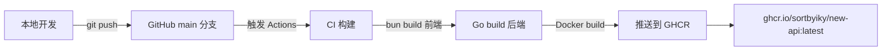
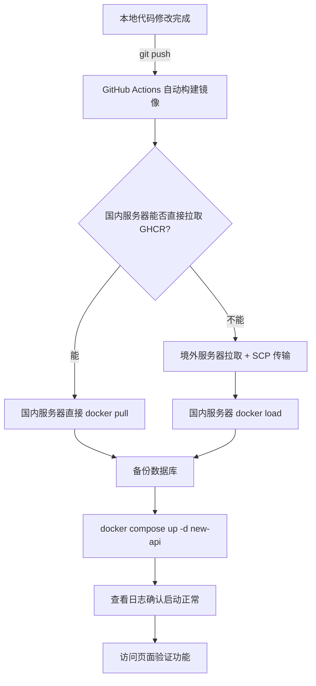

# Scholar API 部署与运维手册

> [!info] 文档说明
> 本文档记录了 Scholar API（基于 new-api fork）的部署流程、数据持久化方案、升级策略和注意事项。
> 适用于服务器环境：Ubuntu 24.04 + Docker Compose + PostgreSQL 15。

---

## 1. 项目概览

### 1.1 Fork 信息

| 项目 | 说明 |
|------|------|
| 上游仓库 | `QuantumNous/new-api` |
| Fork 仓库 | `sortbyiky/new-api` |
| 镜像地址 | `ghcr.io/sortbyiky/new-api:latest` |
| 技术栈 | Go 1.25+ (Gin/GORM) + React 18 (Vite/Semi Design) |
| 数据库 | PostgreSQL 15 |
| 缓存 | Redis 7 |

### 1.2 自定义功能清单

| 功能模块 | 说明 |
|----------|------|
| 额度卡管理 | 生成、分发、兑换、撤销预付费额度卡 |
| 用户订阅管理 | 查看订阅详情、手动重置每日额度 |
| 消费统计 | 每日/每月/按模型统计，VChart 图表可视化 |
| 订阅调整 | 管理员延长/缩短有效期、修改额度、操作审计 |
| 周消耗上限 | daily 重置周期的订阅支持额外的周消耗限制 |
| 侧边栏模块开关 | 管理员可控制用户侧边栏模块可见性 |
| 品牌定制 | 去除原开源项目 Footer 品牌标识 |

---

## 2. CI/CD 构建流程

### 2.1 GitHub Actions 工作流

> [!tip] 自动构建
> 每次向 `main` 分支推送代码，GitHub Actions 自动构建 Docker 镜像并推送到 GHCR。

**工作流文件**：`.github/workflows/docker-image-fork.yml`

**触发条件**：
- 推送到 `main` 分支
- 手动触发（workflow_dispatch）

**构建产物**：
- `ghcr.io/sortbyiky/new-api:latest`（最新版）
- `ghcr.io/sortbyiky/new-api:<日期>-<commit>`（版本化标签，如 `20260329-e65ac4b`）

### 2.2 构建流程图



---

## 3. 服务器部署

### 3.1 服务器信息

| 项目 | 国内服务器 | 境外服务器 |
|------|-----------|-----------|
| IP | `62.234.194.92` | `154.40.37.114` |
| 系统 | Ubuntu 24.04 | Ubuntu 22.04 |
| 用途 | 生产部署 | 镜像中转 |
| 部署路径 | `/usr/local/ai/new-api/` | - |

### 3.2 Docker Compose 配置

部署文件位于 `/usr/local/ai/new-api/docker-compose.yml`：

```yaml
services:
  new-api:
    image: ghcr.io/sortbyiky/new-api:latest
    container_name: new-api
    restart: always
    command: --log-dir /app/logs
    ports:
      - "3000:3000"
    volumes:
      - ./data:/data          # 应用数据（SQLite 场景下的数据库文件等）
      - ./logs:/app/logs      # 应用日志
    environment:
      - SQL_DSN=postgresql://root:<password>@postgres:5432/new-api
      - REDIS_CONN_STRING=redis://:<password>@172.17.0.1:8890
      - TZ=Asia/Shanghai
      - ERROR_LOG_ENABLED=true
      - BATCH_UPDATE_ENABLED=true
    depends_on:
      - postgres
    healthcheck:
      test: ["CMD-SHELL", "wget -q -O - http://localhost:3000/api/status | grep -o '\"success\":\\s*true' || exit 1"]
      interval: 30s
      timeout: 10s
      retries: 3

  postgres:
    image: postgres:15
    container_name: postgres
    restart: always
    environment:
      POSTGRES_USER: root
      POSTGRES_PASSWORD: <password>
      POSTGRES_DB: new-api
    volumes:
      - pg_data:/var/lib/postgresql/data   # 数据持久化到 Docker Volume
    ports:
      - "15432:5432"

volumes:
  pg_data:    # PostgreSQL 数据卷，容器重建不受影响
```

> [!warning] 安全提醒
> 实际部署中请替换 `<password>` 为真实密码。**禁止将含密码的配置文件提交到 Git 仓库。**

### 3.3 关键挂载说明

| 挂载项 | 容器路径 | 宿主机路径/卷名 | 用途 |
|--------|---------|----------------|------|
| `./data` | `/data` | `/usr/local/ai/new-api/data` | 应用运行时数据 |
| `./logs` | `/app/logs` | `/usr/local/ai/new-api/logs` | 应用日志 |
| `pg_data` | `/var/lib/postgresql/data` | Docker Named Volume | **PostgreSQL 数据库文件（核心数据）** |

> [!important] 数据持久化核心
> PostgreSQL 数据存储在 Docker Named Volume `pg_data` 中。只要不执行 `docker volume rm pg_data`，无论怎么重建容器、更换镜像，数据库数据都不会丢失。

---

## 4. 数据持久化与备份方案

### 4.1 数据存储架构

```mermaid
flowchart TB
    subgraph Docker
        A[new-api 容器] -->|SQL_DSN| B[postgres 容器]
        B -->|数据写入| C[pg_data Volume]
    end
    subgraph 宿主机
        D[/usr/local/ai/new-api/data] -->|bind mount| A
        E[/usr/local/ai/new-api/logs] -->|bind mount| A
        C -->|Docker 管理| F[/var/lib/docker/volumes/...]
    end
```

### 4.2 备份策略

#### 手动备份（推荐在升级前执行）

```bash
# 完整备份 PostgreSQL 数据库
mkdir -p /usr/local/ai/new-api/backups
docker exec postgres pg_dumpall -U root > /usr/local/ai/new-api/backups/pg_backup_$(date +%Y%m%d_%H%M%S).sql

# 验证备份文件
ls -lh /usr/local/ai/new-api/backups/
```

#### 自动定时备份（crontab）

```bash
# 编辑 crontab
crontab -e

# 每天凌晨 3 点自动备份，保留最近 7 天
0 3 * * * mkdir -p /usr/local/ai/new-api/backups && docker exec postgres pg_dumpall -U root > /usr/local/ai/new-api/backups/pg_backup_$(date +\%Y\%m\%d).sql && find /usr/local/ai/new-api/backups -name "pg_backup_*.sql" -mtime +7 -delete
```

#### 备份恢复

```bash
# 从备份恢复（危险操作，仅在数据确实丢失时执行）
docker exec -i postgres psql -U root -d new-api < /usr/local/ai/new-api/backups/pg_backup_YYYYMMDD_HHMMSS.sql
```

> [!danger] 恢复操作警告
> 恢复操作会覆盖当前数据库中的数据。执行前请确认当前数据已不可用，且备份文件是正确的版本。

### 4.3 当前备份记录

| 备份时间 | 文件路径 | 大小 | 备注 |
|----------|---------|------|------|
| 2026-03-29 17:25 | `/usr/local/ai/new-api/backups/pg_backup_20260329_172542.sql` | 34MB | 升级到 fork 镜像前的完整备份 |

---

## 5. 升级流程

### 5.1 标准升级步骤

> [!tip] 升级原则
> 只替换 `new-api` 应用容器，**PostgreSQL 容器和数据卷始终保持不变**。



### 5.2 完整升级命令（通过境外服务器中转）

**Step 1：本地推送代码**

```bash
cd /path/to/new-api
git add -A && git commit -m "feat: 功能描述" && git push origin main
```

**Step 2：等待 GitHub Actions 构建完成**

访问 `https://github.com/sortbyiky/new-api/actions` 确认构建成功。

**Step 3：境外服务器拉取并导出镜像**

```bash
# SSH 到境外服务器
ssh root@154.40.37.114

# 拉取最新镜像
docker pull ghcr.io/sortbyiky/new-api:latest

# 导出为 tar 文件
docker save ghcr.io/sortbyiky/new-api:latest -o /tmp/new-api-latest.tar

# 传输到国内服务器
scp /tmp/new-api-latest.tar root@62.234.194.92:/tmp/

# 清理
rm /tmp/new-api-latest.tar
```

**Step 4：国内服务器加载镜像并部署**

```bash
# SSH 到国内服务器
ssh root@62.234.194.92

# 加载镜像
docker load -i /tmp/new-api-latest.tar

# 备份数据库（升级前必做）
docker exec postgres pg_dumpall -U root > /usr/local/ai/new-api/backups/pg_backup_$(date +%Y%m%d_%H%M%S).sql

# 重启应用容器（PostgreSQL 不动）
cd /usr/local/ai/new-api
docker compose up -d new-api

# 查看启动日志
docker logs -f new-api --tail 50

# 清理临时文件
rm /tmp/new-api-latest.tar
```

**Step 5：验证**

- 访问 `http://62.234.194.92:3000` 确认页面正常
- 检查日志中 `database migration started` 确认迁移完成
- 检查日志中 `system is already initialized` 确认数据保留
- 登录后台确认原有数据（用户、渠道、令牌等）完整

### 5.3 一键升级脚本

将以下脚本保存到国内服务器 `/usr/local/ai/new-api/upgrade.sh`：

```bash
#!/bin/bash
set -e

REMOTE_HOST="154.40.37.114"
REMOTE_USER="root"
IMAGE="ghcr.io/sortbyiky/new-api:latest"
BACKUP_DIR="/usr/local/ai/new-api/backups"
COMPOSE_DIR="/usr/local/ai/new-api"
TMP_TAR="/tmp/new-api-latest.tar"

echo "=== [1/5] 通过境外服务器拉取最新镜像 ==="
ssh ${REMOTE_USER}@${REMOTE_HOST} "docker pull ${IMAGE} && docker save ${IMAGE} -o ${TMP_TAR}"

echo "=== [2/5] 传输镜像到本地 ==="
scp ${REMOTE_USER}@${REMOTE_HOST}:${TMP_TAR} ${TMP_TAR}
ssh ${REMOTE_USER}@${REMOTE_HOST} "rm -f ${TMP_TAR}"

echo "=== [3/5] 加载镜像 ==="
docker load -i ${TMP_TAR}
rm -f ${TMP_TAR}

echo "=== [4/5] 备份数据库 ==="
mkdir -p ${BACKUP_DIR}
docker exec postgres pg_dumpall -U root > ${BACKUP_DIR}/pg_backup_$(date +%Y%m%d_%H%M%S).sql
echo "备份完成: $(ls -lh ${BACKUP_DIR}/pg_backup_*.sql | tail -1)"

echo "=== [5/5] 重启应用容器 ==="
cd ${COMPOSE_DIR}
docker compose up -d new-api

echo ""
echo "=== 升级完成 ==="
echo "等待 5 秒后查看启动日志..."
sleep 5
docker logs new-api --tail 20
```

```bash
# 赋予执行权限
chmod +x /usr/local/ai/new-api/upgrade.sh

# 执行升级
/usr/local/ai/new-api/upgrade.sh
```

---

## 6. 数据库迁移安全性

### 6.1 GORM AutoMigrate 行为

| 操作类型 | GORM 行为 | 影响 |
|----------|----------|------|
| 新增表 | `CREATE TABLE IF NOT EXISTS` | 不影响已有表 |
| 新增列 | `ALTER TABLE ADD COLUMN` | 已有数据不受影响，新列填充默认值 |
| 修改列类型 | **不执行** | GORM 不会自动修改已有列类型 |
| 删除列 | **不执行** | GORM 不会自动删除列 |
| 删除表 | **不执行** | GORM 不会自动删除表 |

> [!success] 安全结论
> GORM AutoMigrate 只做**加法操作**（新增表、新增列），不会执行任何破坏性操作。升级时数据库数据100%安全。

### 6.2 本次 Fork 新增的数据库变更

**新增表**：

| 表名 | 用途 |
|------|------|
| `quota_cards` | 额度卡管理 |
| `redemption_records` | 额度卡兑换记录 |

**`subscription_plans` 表新增列**：

| 列名 | 类型 | 默认值 | 用途 |
|------|------|--------|------|
| `manual_daily_reset_limit` | `int` | `0` | 每天允许手动重置次数 |
| `weekly_quota_limit` | `bigint` | `0` | 周消耗上限 |

**`user_subscriptions` 表新增列**：

| 列名 | 类型 | 默认值 | 用途 |
|------|------|--------|------|
| `manual_reset_count` | `int` | `0` | 用户当天已手动重置次数 |
| `manual_reset_date` | `varchar(10)` | `''` | 上次手动重置日期 |
| `weekly_quota_used` | `bigint` | `0` | 本周已消耗额度 |
| `weekly_quota_reset_time` | `bigint` | `0` | 周消耗计数器下次重置时间 |

> [!note] 所有新增列都带默认值
> 旧数据在迁移后自动填充默认值（0 或空字符串），不会出现 NULL 异常。

---

## 7. 注意事项

### 7.1 国内服务器拉取 GHCR 镜像问题

国内服务器（腾讯云等）无法直接从 `ghcr.io` 拉取镜像（速度极慢或超时）。解决方案：


### 7.2 Docker Compose 版本警告

启动时可能出现：
```
WARN: the attribute `version` is obsolete, it will be ignored
```
这是 Docker Compose V2 的兼容性提示，不影响运行。如需消除，删除 `docker-compose.yml` 中的 `version: '3.4'` 行即可。

### 7.3 禁止操作清单

| 操作 | 后果 | 替代方案 |
|------|------|---------|
| `docker volume rm pg_data` | **数据库数据永久丢失** | 仅在确认不需要数据时执行 |
| `docker compose down -v` | **删除所有 Volume，数据丢失** | 使用 `docker compose down`（不加 `-v`） |
| 直接修改 PostgreSQL 数据文件 | 可能导致数据损坏 | 通过 SQL 操作数据 |
| 将密码提交到 Git | 安全隐患 | 使用环境变量或 `.env` 文件 |

> [!danger] 最危险的命令
> `docker compose down -v` 会删除所有 Docker Volume（包括 `pg_data`），**数据库数据将永久丢失**。
> 正确的停止命令是 `docker compose down`（不加 `-v`）。

### 7.4 日志查看

```bash
# 查看实时日志
docker logs -f new-api --tail 100

# 查看最近的错误日志
docker logs new-api --tail 200 2>&1 | grep -i "error\|fatal\|panic"

# 查看文件日志（如果启用了 --log-dir）
ls -la /usr/local/ai/new-api/logs/
```

### 7.5 健康检查

```bash
# API 健康检查
curl -s http://localhost:3000/api/status | python3 -m json.tool

# 容器健康状态
docker inspect --format='{{.State.Health.Status}}' new-api

# PostgreSQL 连接检查
docker exec postgres pg_isready -U root
```

---

## 8. 故障恢复

### 8.1 容器启动失败

```bash
# 查看详细错误日志
docker logs new-api --tail 100

# 常见原因：
# 1. PostgreSQL 未就绪 → 等待几秒后重试
# 2. 端口冲突 → lsof -ti:3000 | xargs kill -9
# 3. 镜像损坏 → 重新从境外服务器传输镜像
```

### 8.2 回滚到旧版本

```bash
# 修改 docker-compose.yml 回滚到官方镜像
sed -i 's|ghcr.io/sortbyiky/new-api:latest|calciumion/new-api:latest|' /usr/local/ai/new-api/docker-compose.yml

# 重启
cd /usr/local/ai/new-api
docker compose up -d new-api
```

> [!warning] 回滚注意
> 回滚到旧版镜像后，新增的表和列仍然存在于数据库中（GORM 不会删除它们），但不会影响旧版功能正常运行。

### 8.3 数据库恢复

```bash
# 列出所有备份
ls -lht /usr/local/ai/new-api/backups/

# 恢复指定备份
docker exec -i postgres psql -U root -d new-api < /usr/local/ai/new-api/backups/pg_backup_YYYYMMDD_HHMMSS.sql
```

---

## 9. 版本历史

| 版本 | 日期 | 变更内容 |
|------|------|---------|
| `20260329-e65ac4b` | 2026-03-29 | 初始 fork 部署：额度卡、订阅管理、消费统计、订阅调整、周消耗上限、侧边栏模块开关、Footer品牌定制 |

---

> [!quote] 文档维护
> 每次重大功能更新或架构变更后，请同步更新本文档。
> 最后更新时间：2026-03-29
